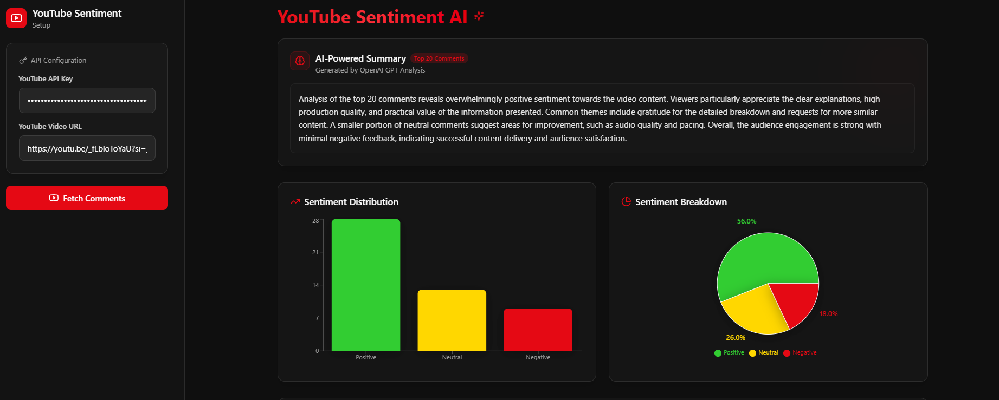
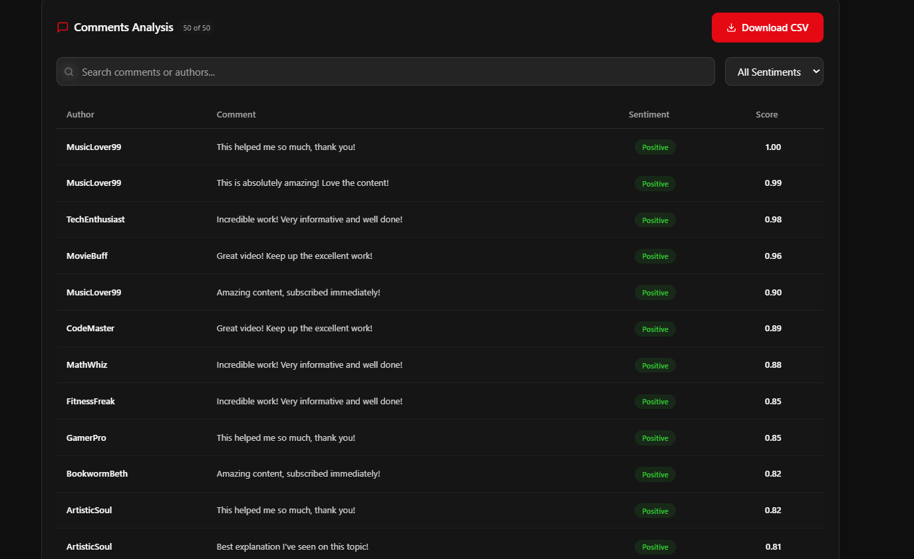

<div align="center">

# Sentilytics

### AI-Powered YouTube Sentiment Analysis Dashboard

<p align="center">
  Real-time multilingual YouTube comment sentiment analysis platform powered by <strong>BERT</strong>, <strong>OpenAI</strong>, <strong>Streamlit</strong>, and <strong>NLP pipelines</strong>.
</p>

<br/>


</div>

---

# Overview

Sentilytics is an AI-powered sentiment analysis dashboard designed to analyze YouTube comments in real time using Natural Language Processing and transformer-based deep learning models.

The platform extracts comments from YouTube videos, performs multilingual sentiment analysis, generates AI-powered summaries, and visualizes audience reactions through interactive analytics dashboards.

This project combines NLP engineering, AI analytics, and modern dashboard design into a complete end-to-end sentiment intelligence platform.

---

# Core Features

## AI Sentiment Analysis
- Real-time YouTube comment analysis
- BERT-powered sentiment classification
- VADER sentiment scoring
- Multilingual NLP processing
- Positive, Neutral, and Negative prediction

## AI-Powered Summary
- OpenAI-generated audience summary
- Smart sentiment interpretation
- Viewer feedback insights
- Automated engagement analysis

## Interactive Dashboard
- Modern dark-themed UI
- Real-time sentiment charts
- Pie chart and bar chart analytics
- Searchable comment analysis table
- Sentiment filtering system
- CSV export functionality

## NLP & Analytics Pipeline
- YouTube Data API integration
- Comment extraction pipeline
- Transformer-based text analysis
- Language detection support
- Automated preprocessing workflow

---

# Tech Stack

| Category | Technologies |
|---|---|
| AI / NLP | BERT, Transformers, VADER, OpenAI |
| Backend | Python |
| Dashboard | Streamlit |
| Data Processing | Pandas, NumPy |
| Visualization | Plotly, Matplotlib |
| APIs | YouTube Data API |
| Tools | VS Code, GitHub |

---

# Project Architecture

```text
YouTube Video URL
        ↓
YouTube Data API
        ↓
Comment Extraction Pipeline
        ↓
BERT + NLP Sentiment Analysis
        ↓
OpenAI Summary Generation
        ↓
Interactive Analytics Dashboard
```

## Screenshots

### Dashboard


### Sentiment Charts


### Comments Analysis


---

# System Workflow

1. User enters YouTube video URL  
2. YouTube API fetches comments  
3. NLP pipeline preprocesses text  
4. BERT performs sentiment analysis  
5. OpenAI generates AI-powered summary  
6. Dashboard visualizes insights  
7. User exports sentiment analytics  

---

# Installation Guide

## Clone Repository

```bash
git clone https://github.com/AbiramiMuthiah/sentilytics.git

cd sentilytics

---

# Future Improvements

- Advanced transformer-based sentiment analysis  
- Real-time live stream analytics  
- Multi-platform social media integration  
- AI toxicity and spam detection  
- Emotion recognition system  
- Cloud deployment pipeline  
- User authentication system  
- Real-time dashboard streaming  
- Fine-tuned multilingual LLM integration  

---

# Project Highlights

- AI-powered sentiment intelligence platform  
- Real-time YouTube analytics dashboard  
- Transformer-based NLP pipeline  
- OpenAI-generated audience insights  
- Interactive visualization system  
- Full-stack AI analytics workflow  
- Modern dark-themed dashboard UI  
- Industrial-level NLP engineering architecture  

---

# Author

## Abirami Muthiah

Applied AI Engineer | NLP & Data Science Developer  

### Specializations

- Natural Language Processing  
- Applied AI Systems  
- Machine Learning  
- AI Analytics Platforms  
- Deep Learning  
- Full-Stack AI Development  

GitHub:

https://github.com/AbiramiMuthiah

---

# License

Licensed under the MIT License.